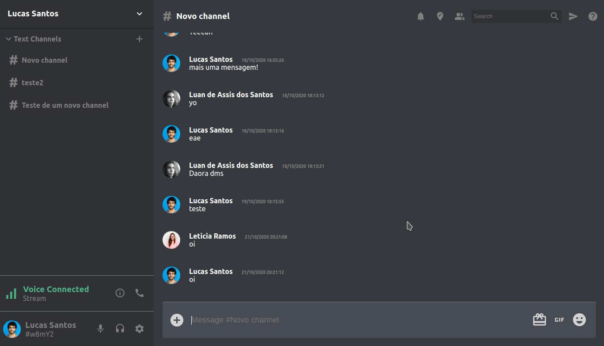

<br>
<h1 align="center">
    Discord Clone
</h1>

Aplicação simples desenvolvida utilizando ```ReactJS```, com o intuito de aprender mais sobre o framework. Neste projeto foram utilizados também ```Redux``` e recursos da plataforma ```Firebase```.

## Imagens

<div align="center">
  
  
</div>

## Recursos

Foram desenvolvidas aqui funcionalidades e o layout básico relacionado à criação de canais de chat e o envio de mensagens em tempo real.
Para isso utilizei o recurso de login pelo Google para identificação do usuário e o banco Cloud Firestore para o gerenciamento de canais e mensagens. 

## Utilização

1) Antes de mais nada é necessário criar o arquivo ```src/config/firebaseConfig.js``` com as configurações do Firebase (à exemplo do arquivo firebaseConfig-example.js).

2) Com o NodeJS devidamente instalado, executar a instalação das dependências do projeto:
```bash
> npm install
# ou
# yarn
```

3) Iniciar o projeto:
```bash
> npm start
# ou
# yarn start
```